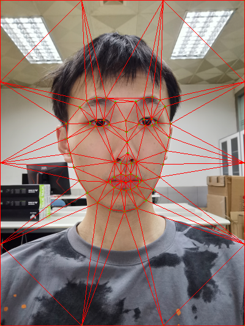

# Project3 morphing

> 计算机85张子诚

## 文件结构树

```shell
├── frames
│   ├── 0.png
│   ├── 10.png
│   ├── 11.png
│   ├── 12.png
│   ├── 13.png
│   ├── 14.png
│   ├── 15.png
│   ├── 16.png
│   ├── 17.png
│   ├── 18.png
│   ├── 19.png
│   ├── 1.png
│   ├── 2.png
│   ├── 3.png
│   ├── 4.png
│   ├── 5.png
│   ├── 6.png
│   ├── 7.png
│   ├── 8.png
│   └── 9.png
├── generate.py
├── img
│   ├── lmg.jpg
│   └── zzc.jpg
├── morph.py
├── pre.dat
├── readme.md
├── run.sh
├── test
│   ├── lmg_mean.png
│   ├── lmg.png
│   ├── zzc_mean.png
│   └── zzc.png
└── videos
    └── output.avi

```
* `morph.py` 为主运行脚本生成视频帧
* `generate.py` 为生成视频的脚本
* `frames` 文件夹存放着`morph.py`生成的视频帧
* `img` 文件夹存放原图像
* `test` 保存了一些中间结果图
* `videos` 存放着生成的视频

## 环境依赖

> 主要是自己运行环境的展示

OS: linux

env:anaconda
* numpy
* cv2
* dlib
* imutils
* scipy
* argparse
* os

## 运行
直接执行`run.sh` 文件
```shell
wget http://dlib.net/files/shape_predictor_68_face_landmarks.dat.bz2
bzip2 -d shape_predictor_68_face_landmarks.dat.bz2
mv shape_predictor_68_face_landmarks.dat pre.dat
python morph.py -p pre.dat
python generate.py 
```
## 步骤

**step0：获取剖分点**
```python
def generate_point(img,pre):
    H,W,_=img.shape
    detector=dlib.get_frontal_face_detector()
    landmark_predictor=dlib.shape_predictor(pre) 
    # 检测人脸
    rects=detector(img,1)
    for (i,rect) in enumerate(rects):
        shape=landmark_predictor(img,rect)
        shape=shape_to_numpy(shape)
        edges=np.array([
            [0,0],[W-1,H-1],[W-1,0],[0,H-1],
            [W-1,H//4],[0,H//4],[W//3,0],[W//3,H-1],
            [W-1,H//2],[0,H//2],[2*W//3,0],[2*W//3,H-1],
            [W-1,3*H//4],[0,3*H//4],
        ],dtype=np.int)
        shape=np.vstack([edges,shape])

        return shape
```
利用`dlib` 提供的人脸检测模型，提取出面部特征68个点，同时我们添加一些图像边缘点

**step1:三角剖分**
```python
tr=Delaunay(img2_points).simplices 
```
注意仅计算一次剖分

剖分可视化




**step2:三角面片的Affine生成平均图像**

```python
# 对三角区域进行affine
def affineTriangle(img1,img2,tr1,tr2):
    # 计算包裹该三角形的最小长方形
    r1=cv.boundingRect(tr1)
    r2=cv.boundingRect(tr2)
    # 我们要将affine应用与此处方块
    # 需要更改三角形的坐标
    tri1Cropped = []
    tri2Cropped = []
    for i in range(3):
        tri1Cropped.append([tr1[i][0]-r1[0],tr1[i][1]-r1[1]])
        tri2Cropped.append([tr2[i][0]-r2[0],tr2[i][1]-r2[1]])

    img1Cropped =img1[r1[1]:r1[1]+r1[3],r1[0]:r1[0]+r1[2]]
    # 获得Affine Matrix
    AffineMat=cv.getAffineTransform(np.float32(tri1Cropped),np.float32(tri2Cropped))
    # Apply the Affine Matrix
    img2Cropped=cv.warpAffine(img1Cropped,AffineMat,(r2[2], r2[3]),None, flags=cv.INTER_LINEAR, borderMode=cv.BORDER_REFLECT_101)

    # Get mask 过滤出三角形
    mask=np.zeros((r2[3],r2[2],3),dtype=np.float32)
    cv.fillConvexPoly(mask, np.int32(tri2Cropped), (1.0, 1.0, 1.0), 16, 0);

    img2Cropped = img2Cropped * mask

    img2[r2[1]:r2[1]+r2[3], r2[0]:r2[0]+r2[2]] = img2[r2[1]:r2[1]+r2[3], r2[0]:r2[0]+r2[2]] * ( (1.0, 1.0, 1.0) - mask )
    
    img2[r2[1]:r2[1]+r2[3], r2[0]:r2[0]+r2[2]] = img2[r2[1]:r2[1]+r2[3], r2[0]:r2[0]+r2[2]] + img2Cropped

```
由于opencv中的warpAffine的操作对象为矩形，所以我们对三角Affine的时候需要先用一个最小矩形框进行变换，之后对矩形框进行掩码还原为三角形

最后生成平均图像结果如下


**step3:图像融合**

```python
new_img =np.uint8(np.round(factor*img1_mean+(1-factor)*img2_mean))
```
最后结果

